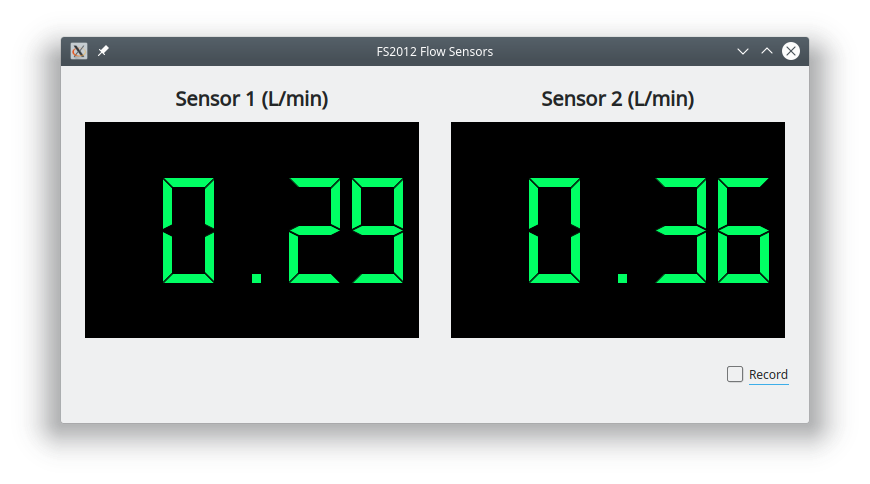

## fs2012_flow_sensor  

Firmware, Python library, PyQt GUI for working with the FS2012 flow sensors. 




# Requirements

* [pyserial](https://pythonhosted.org/pyserial/)
* [pyqt5](https://pypi.org/project/PyQt5/)


# Installation


```bash
$python setup.py install
```

or

```bash
$python setup.py develop 
```

# DataReader Example

```python
import time
from fs2012_flow_sensor import DataReader

port = '/dev/ttyACM0'
reader = DataReader(port)
reader.start()
for i in range(10):
    print(reader.get_data())
    time.sleep(0.1)
reader.stop()

```

# Running the flow_sensor_app

```bash
$python flow_sensor_app /dev/ttyACM0
```

